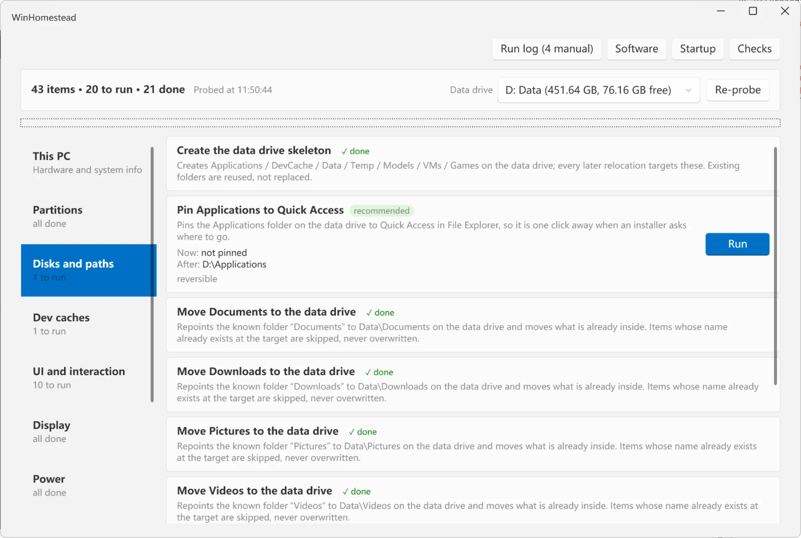

<div align="center">

# WinHomestead · 开荒

**Windows 11 新机开荒工具 —— 从开箱到顺手，该改的设置逐项配到位**

**简体中文** · [English](README_EN.md)

[](https://github.com/CookPiu/WinHomestead/releases/latest)
[](https://github.com/CookPiu/WinHomestead/releases)
[](https://github.com/CookPiu/WinHomestead/actions/workflows/build.yml)
[](LICENSE)
[](#系统要求)

</div>

新电脑到手，该改的设置散在系统设置、文件夹选项、注册表、输入法属性、磁盘管理里，一项项翻过去要花掉一下午，还总有几处想不起来。

开荒把这些归拢到一张列表：**界面与交互、中文输入法、磁盘与路径、显示与电源、启动项、空间清理、安全检查、软件规划**。工具启动先探测这台机器，然后逐项列出——每一项显示**现在是什么样、改完是什么样**，你点哪一项就做哪一项，做完就地刷新状态。

没有问卷，没有"一键优化"，没有你不知道它改了什么的黑盒。每一项都写清楚改的是什么、为什么值得改、有什么副作用。

界面跟随系统语言：中文系统显示中文，其余显示英文。

<div align="center">
  
</div>

> [!IMPORTANT]
> 早期版本（0.1.x），发布产物**没有代码签名**，首次运行会被 SmartScreen 拦一下。工具会改系统设置，虽然每项都可回滚、执行前也会建还原点，但建议先在虚拟机或不重要的机器上试一遍。

## 下载

到 [Releases](https://github.com/CookPiu/WinHomestead/releases/latest) 下载这两个文件，**放在同一个目录**，双击 exe 运行：

| 文件 | 说明 |
|---|---|
| `WinHomestead.exe` | 单文件程序，依赖已全部嵌入 |
| `WinHomestead.exe.config` | 绑定重定向与运行时声明，缺了会启动失败 |

SmartScreen 弹蓝框时点「更多信息」→「仍要运行」。不放心就[自己从源码构建](#构建)。

### 系统要求

- Windows 11 22H2 及以上
- 管理员账户（程序启动时提权一次）
- 无需安装 .NET——用的是系统自带的 .NET Framework 4.8

界面跟随系统语言，也可以用启动参数强制：`WinHomestead.exe --lang en` 或 `--lang zh`。

## 能做什么

**界面与交互** —— 装完系统第一批要改的
- 显示文件扩展名与隐藏文件、资源管理器打开到「此电脑」、桌面显示「此电脑」、任务栏右键「结束任务」
- 关掉鼠标加速、粘滞键与筛选键、Alt+Shift 语言热键这几个误触来源
- 标题栏显示完整路径、任务栏按钮从不合并、时钟显示秒、快速访问不留最近项目、关掉抖动最小化
- 任务栏对齐与搜索框样式、开始菜单布局、经典右键菜单、深色模式（这些标为可选，不预设立场）
- 一组去推送项：锁屏聚焦、开始菜单建议、静默推荐安装、搜索联网结果、广告 ID、资源管理器里的同步提供程序通知

**中文输入法** —— 微软拼音里要找半天的三个开关
- 启动时默认英文模式、关掉 Ctrl+. 标点切换、关掉单击 Shift 切中英文

**磁盘与路径**
- 识别数据盘；单盘无分区时给分盘建议，条件都满足才提供一键压缩 C 并新建 D
- 在数据盘建好目录骨架，把文档 / 下载 / 图片 / 视频 / 音乐和 TEMP 迁过去
- 桌面被 OneDrive 接管时不硬来，只告诉你去哪儿关

**开发环境** —— 在装工具*之前*先铺路
- 一次预设 pip、uv、npm、pnpm、Yarn、Gradle、Maven、NuGet、vcpkg、Cargo、Go、Flutter、Conda、Hugging Face、Ollama 的缓存位置
- 已经设过的变量不动，已经装了的工具跳过——那是搬家不是开荒
- Dev Drive 建议：检测数据盘是不是 ReFS，按未分配空间给出创建方案。只建议，不格式化任何卷

**显示与电源**
- 把刷新率拉到当前分辨率支持的最高值——高刷屏出厂跑 60 Hz 是新机常态
- 关闭快速启动，让「关机」真的是关机（双系统锁盘、外设异常多半和它有关）
- 插电时晚点关屏与睡眠（15 / 60 分钟），电池侧保持系统默认的省电策略
- GPU 硬件加速调度（HAGS），只在显卡与驱动支持时出现

**启动项**
- 列出 Run 键与启动文件夹里的自启项，逐项开关
- 只写 StartupApproved（和任务管理器同一套机制），程序本身不动，随时能开回来

**空间清理**
- 旧临时文件、休眠文件（台式机）、存储感知

**安全与状态检查**（八项只读，只给结论和跳转按钮）
- BitLocker 恢复密钥、多套杀软并存、补丁时间、还原点占用
- OEM 预装软件、电池健康、默认应用、区域时区

**软件规划**
- 官网下载页入口 + 按分类规划好的安装路径，一键复制
- 不下载、不静默安装、不内置安装包

**机器信息与执行记录**
- 「这台电脑」列出硬件与各卷容量，给精确值不四舍五入
- 每次会话的执行结果、需要手动处理的事项可导出成 HTML 报告

## 不做什么

这些是**有意不做**，不是还没做：

- ❌ 不卸载微软预装应用，不禁用系统服务，不动 Windows Update
- ❌ 不碰 UAC、SmartScreen、内存完整性这些安全设置
- ❌ 不改 DNS、Hosts、IPv6 等网络配置
- ❌ 不联网——不检查更新、不上传数据、没有遥测
- ❌ 不扫描旧机垃圾文件，开荒面对的是全新机器

判断标准是"效果能不能感知、风险对不对称"。收益不明显却可能留坑的，一律不做——所以它不是一个"加速"工具，装了它跑分不会变高。它做的是把新机该配的设置一次配对，让这台电脑用起来顺手、东西放得有条理。取舍理由逐条写在[范围清单](docs/01-范围清单.md)里。

## 凭什么敢让它改系统

- **执行前建还原点** —— 每次会话第一次执行前自动创建
- **写操作全程记账** —— 改动前的原值写进 `%ProgramData%\WinHomestead\journal-*.jsonl`
- **失败自动回滚** —— 单项失败按 journal 逐条还原，不留半吊子状态
- **不可逆的单独对待** —— 分区类操作执行前二次确认，永远不删除、不移动、不合并已有分区
- **认得出受管设备** —— MDM / 域环境下涉及 HKLM 的条目自动跳过并说明原因
- **探测无副作用** —— Detect 阶段只读注册表和 WMI，不写任何东西

## 常见问题

<details>
<summary>和那些一键优化 / 加速工具有什么不一样？</summary>

方向不同。那类工具的卖点是"关掉一堆东西换性能"——禁服务、停计划任务、清注册表、删预装。开荒不做这些，它面对的是一台**还没被用起来**的新机器，要解决的是"该配的设置散在十几个地方、配一遍要一下午"。

具体差别有三条：**逐项可见**，每一项显示改前改后的值和副作用，没有"一键全选"；**可回滚**，改动前的原值记进 journal，失败自动还原；**保守**，微软自家的服务和应用一律不碰。
</details>

<details>
<summary>SmartScreen 说"未知发布者"，能信吗？</summary>

代码签名证书要花钱，这个项目还没买。你可以自己从源码构建（见下），或者看 [Actions](https://github.com/CookPiu/WinHomestead/actions) 里每次提交自动构建出的产物——构建过程是公开的。
</details>

<details>
<summary>已经用了几年的电脑能用吗？</summary>

能，但它不是给这种机器设计的。工具会把已经做过的事标成"已满足"、把做不了的标成"不适用"并说明原因，所以不会乱改。但它**不做**旧机清理：不扫 AppData、不找大文件、不搬已经装好的工具。
</details>

<details>
<summary>为什么不帮我卸掉那堆预装应用？</summary>

微软自家的应用和服务默认全部保留。卸载 Appx、禁用服务这类操作在不同版本上的行为不一致，出问题时又很难回滚，收益（省几百 MB、少几个图标）配不上风险。OEM 预装软件会在检查项里列出来，你自己决定卸不卸。
</details>

<details>
<summary>我的数据会被上传吗？</summary>

不会。工具全程不联网：不检查更新、不回传统计、没有遥测。唯一会起外部进程的是电池健康检查——固件读不到设计容量时调一次 `powercfg /batteryreport`，生成的临时文件读完即删。
</details>

<details>
<summary>改完能撤销吗？</summary>

注册表和环境变量类的改动都能撤销，journal 里存着原值。分区操作不可逆——这类条目默认不勾选，执行前有二次确认。
</details>

## 构建

需要 .NET 10 SDK（只有构建需要；产物运行只依赖系统自带的 .NET Framework 4.8）。

```powershell
git clone https://github.com/CookPiu/WinHomestead.git
cd WinHomestead

.\build\build.ps1          # Debug 构建 + 单元测试
.\build\publish.ps1        # Release 单 exe（Costura 嵌入依赖）+ 体积校验，产物在 artifacts\
.\build\publish.ps1 -Thumbprint <证书指纹>   # 同上并签名（SHA256 + RFC3161 时间戳）
```

SDK 不在 PATH 里的话，改 `build\build.ps1` 顶部的 `$sdk` 变量指过去就行。

另外 `build\inspect-machine.ps1` 是只读采集脚本，把本机相关设置打印到控制台，用来核对工具的探测结果。它不改任何设置也不发送任何东西，但输出里有机器配置信息，贴到别处之前自己过一眼。

## 项目结构

```
src/WinHomestead.Core     模型、ITask、Planner、TaskRunner、日志、持久化（无 WPF 依赖）
src/WinHomestead.Native   注册表、环境变量、已知文件夹、Explorer、存储、还原点、环境探测
src/WinHomestead.Tasks    任务实现与任务目录
src/WinHomestead.App      WPF 界面（WPF-UI）
tests/                    xUnit 单元测试
build/                    构建脚本与只读采集脚本
```

依赖方向是 App → Tasks → Core 和 App → Native → Core。**Tasks 不引用 Native**，只通过 Core 的接口访问系统——所以每个任务都能用伪实现做单元测试，不需要真去改注册表。

每个任务都实现四个环节：`Detect`（无副作用地判断当前状态）、`Apply`、`Verify`、`Rollback`。想加一条新任务，实现 `ITask` 再注册进 `TaskCatalog` 即可。

## 文档

| 文档 | 内容 |
|---|---|
| [01 范围清单](docs/01-范围清单.md) | 做什么、不做什么，每一项的实现方式与取舍理由 |
| [02 用例与用户流程](docs/02-用例与用户流程.md) | 逐个用例的主流程与异常分支 |
| [03 技术设计](docs/03-技术设计.md) | 分层、执行引擎、journal、原生层封装 |
| [04 发布检查清单](docs/04-发布检查清单.md) | 发布前的自动化门槛与人工走查步骤 |
| [05 开荒操作资料汇编](docs/05-开荒操作资料汇编.md) | 外部资料搜集结果与纳入/排除的依据 |

文档里的"参考机"指开发时用来对照的一台真实机器——它已经用了一阵、装满了工具，正好用来验证"已满足"和"不适用"这两条分支。

## 贡献

欢迎 issue 和 PR。动手前先看 [CONTRIBUTING.md](CONTRIBUTING.md)，那里写着分层约束、任务的四个环节、双语文案的写法和几个容易踩的坑。几条最要紧的：

- 新任务必须实现 Detect / Apply / Verify / Rollback 四个环节，写操作走 `TaskContext` 里带 journal 的封装
- 用户可见的文案一律双语：`L.S("中文", "English")`
- 改动范围或流程时同步更新 `docs/` 下对应文档
- 跑一遍 `.\build\build.ps1`，保证 0 警告 0 错误、测试全绿
- 卸载预装应用、禁用服务、关闭更新这类任务不会被接受，理由见[不做什么](#不做什么)

## 许可

[MIT](LICENSE)
