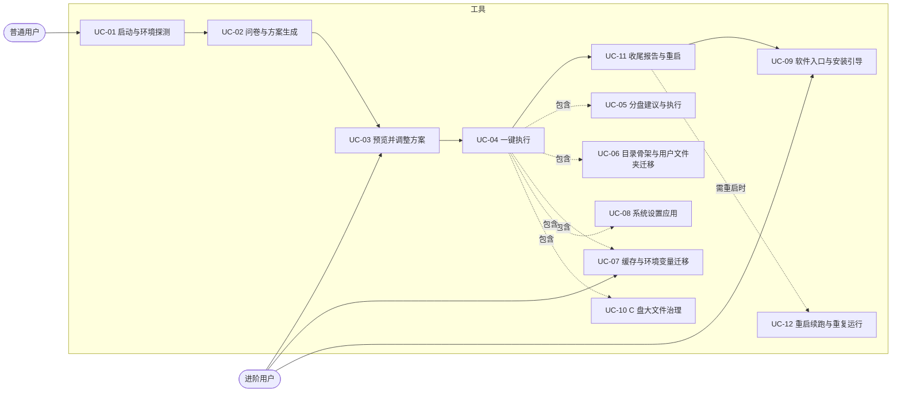
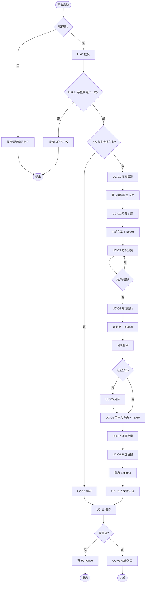
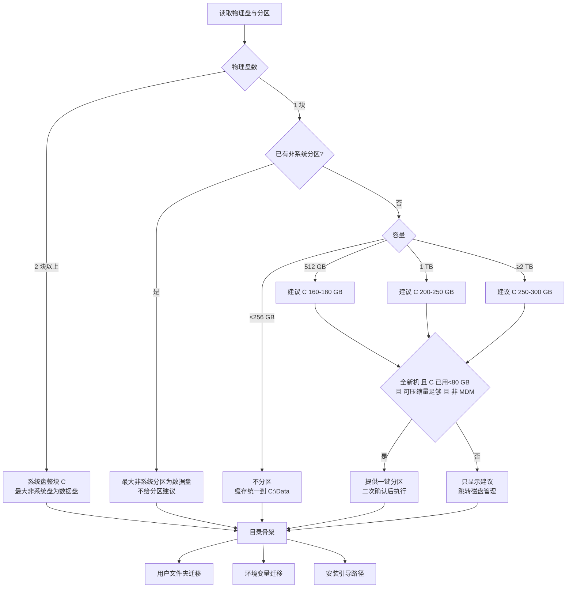
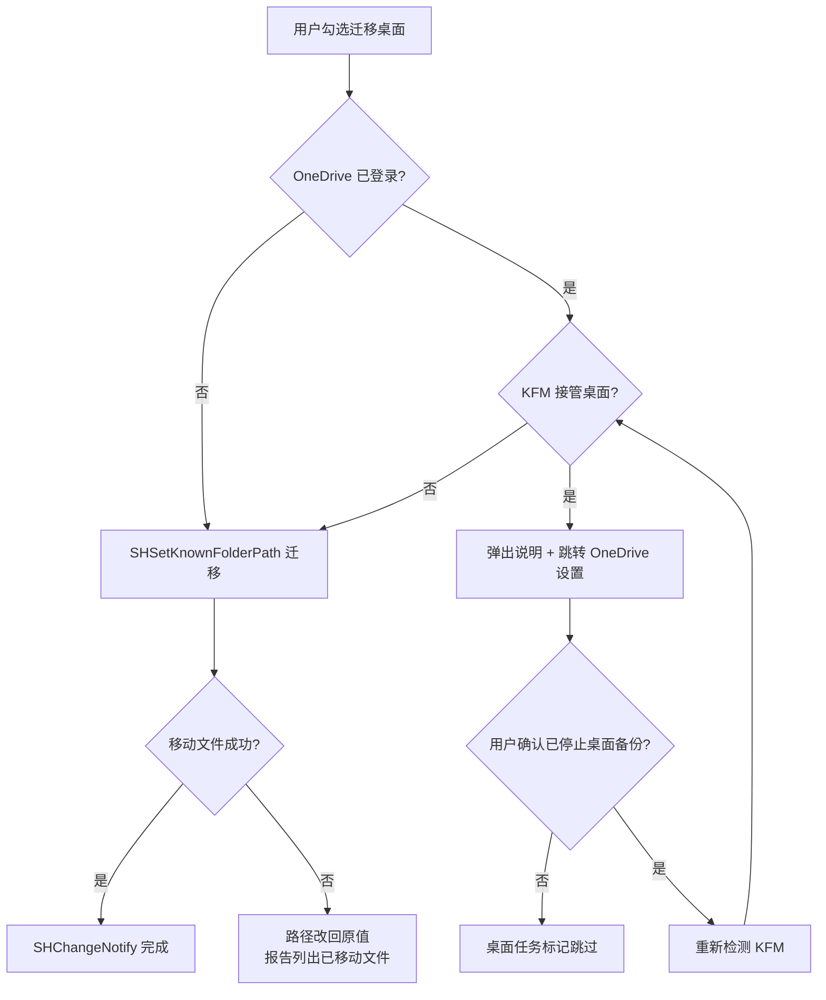
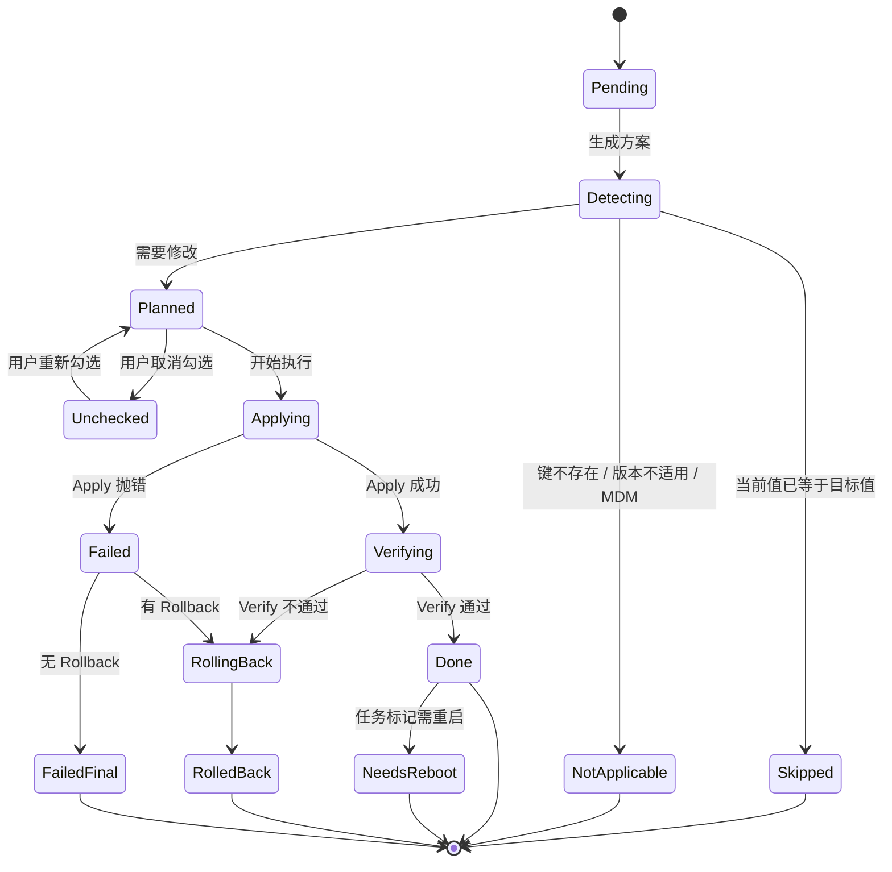
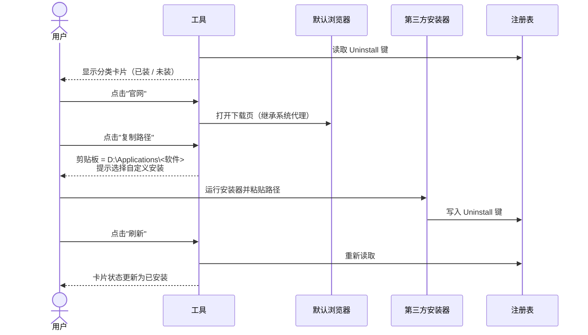
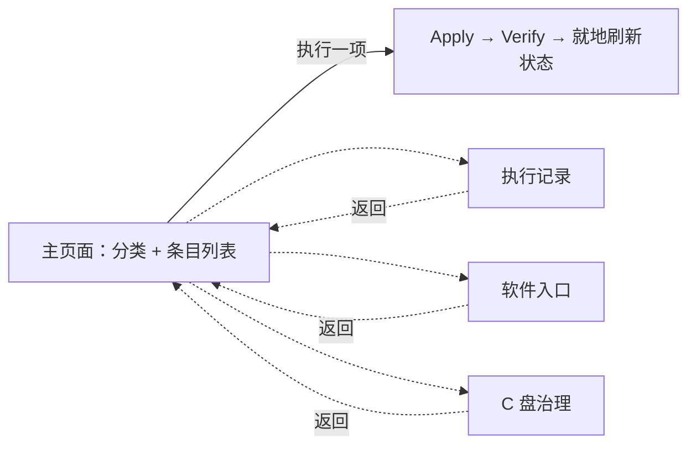

# 新机开荒工具：用例与用户流程 v1

日期：2026-09-03
范围基线：《开荒范围清单 v2》+ GPU 硬件加速调度（加回系统设置模块）。

---

## 1. 参与者

| 参与者 | 说明 |
|---|---|
| 普通用户 | 新机到手，希望一键完成，不关心细节 |
| 进阶用户 | 开发者/游戏玩家，会调整方案、关注路径与缓存 |
| Windows | 注册表、Shell 已知文件夹 API、环境变量、分区服务、还原点 |
| OneDrive | 外部依赖，决定桌面能否迁移 |
| 默认浏览器 | 承接软件官网入口 |
| 第三方安装器 | 工具不控制，仅引导 |

---

## 2. 用例总览

二期用例（本版只留接口）：UC-13 撤销上次执行、UC-14 导出/导入方案。

---

## 3. 用例详述

格式：参与者 / 前置 / 触发 / 主流程 / 分支与异常 / 后置 / 权限。

### UC-01 启动与环境探测

- 参与者：用户、Windows
- 前置：Windows 11 22H2+，用户为管理员组成员
- 触发：双击 exe
- 主流程：
  1. 以管理员启动（manifest requireAdministrator），UAC 弹窗一次。
  2. 校验提权后的 HKCU 与桌面登录用户一致，不一致则提示并退出。
  3. 并行探测：硬件、磁盘与分区、OEM、MDM、代理、OneDrive 状态、已装开发工具、路径类环境变量、C 盘大目录、GPU 是否支持硬件加速调度。
  4. 展示"你的电脑"卡片：机型、盘位、C 盘剩余、数据盘、检测到的工具数量、是否受管理。
- 分支与异常：
  - 非管理员：提示需要管理员账户，退出。
  - MDM/域管：标记"受管理"，后续所有 HKLM 类任务降级为提示。
  - Windows 10：提示不支持，退出。
  - 探测超时（>15 s）：显示已完成部分，允许继续。
- 后置：生成 `EnvironmentSnapshot`，供方案生成器使用。
- 权限：管理员。

### UC-02 问卷与方案生成

- 参与者：用户
- 前置：UC-01 完成
- 触发：点击"开始"
- 主流程：
  1. 单页展示 5 题（用途、数据盘、界面风格、中文输入、是否去推送），每题有默认值。
  2. 数据盘题按探测结果预填；单盘无分区时改问"是否按建议分区"。
  3. 点击"生成方案"，规则引擎按 Snapshot + 答案从任务库筛选任务，逐任务运行 `Detect`，已满足的标为"跳过"。
- 分支与异常：
  - 用户直接点"使用默认"：全部默认值生成方案。
  - 数据盘剩余 < 20 GB：路径迁移任务保留但标红提示。
- 后置：生成 `Plan`（任务列表 + 目标值 + 当前值 + 状态）。
- 权限：普通。

### UC-03 预览并调整方案

- 参与者：用户（进阶用户为主）
- 前置：UC-02 完成
- 触发：进入"方案预览"页
- 主流程：
  1. 按模块分组显示任务：名称、当前值 → 目标值、风险标签（可逆 / 需重启 / 需重启 Explorer / 只提示）。
  2. 默认勾选：磁盘与路径全部（分区除外）、系统设置 4.1 组、问卷选中的 4.2 项、GPU 调度（若支持）。默认不勾选：去推送组、分区执行、系统级 TEMP。
  3. 用户可勾选/取消任意任务、修改数据盘与目录骨架名称。
  4. 顶部汇总：将修改 N 项、跳过 M 项、需重启 K 项。
- 分支与异常：
  - 取消某任务后其依赖任务自动取消（如取消目录骨架则取消所有迁移）。
  - 全部取消：执行按钮置灰。
- 后置：`Plan` 定稿并写入 `%ProgramData%\<App>\plan-<时间戳>.json`。
- 权限：普通。

### UC-04 一键执行

- 参与者：用户、Windows
- 前置：UC-03 定稿
- 触发：点击"开始执行"
- 主流程：
  1. 创建系统还原点（失败仅警告，不阻断）。
  2. 导出将修改的注册表分支到 journal。
  3. 按拓扑顺序执行任务：目录骨架 → 分区（若勾选）→ 用户文件夹 → TEMP → 环境变量 → 系统设置 → 大文件治理提示。
  4. 每任务：Apply → Verify → 记录结果。失败不中断，继续下一个。
  5. 系统设置组完成后重启 Explorer 一次。
  6. 实时进度条 + 当前任务名 + 已完成/失败计数。
- 分支与异常：
  - 单任务失败：记录错误，若有 Rollback 则回滚该任务，继续。
  - 用户点击"停止"：完成当前原子任务后停止，已完成项保留，报告标注"已中止"。
  - 应用崩溃：journal 与 plan 在磁盘，下次启动进入 UC-12。
- 后置：`ExecutionResult` 写入磁盘。
- 权限：管理员。

### UC-05 分盘建议与执行

- 参与者：用户、Windows 分区服务
- 前置：探测到单物理盘且无数据分区，或用户主动进入
- 触发：UC-02 数据盘题选择"按建议分区"
- 主流程：
  1. 按容量规则算出建议 C 大小与 D 大小。
  2. 调用 `Get-PartitionSupportedSize` 取 C 的最小可压缩尺寸，若可释放空间 ≥ 建议 D 的 80%，显示"一键执行"。
  3. 执行前二次确认弹窗，列出：将压缩 C 到 X GB，新建 D 卷 Y GB，不会删除任何数据。
  4. 依次 `Resize-Partition` → `New-Partition` → `Format-Volume`（NTFS，卷标 Data）→ 分配盘符 D。
  5. 刷新 Snapshot，数据盘设为 D。
- 分支与异常：
  - 前置条件不满足（非全新机 / 可压缩量不足 / MDM）：只显示建议数字与"打开磁盘管理"按钮。
  - 压缩失败（不可移动文件阻挡）：提示关闭休眠与页面文件后重试，或手动处理。
  - 盘符 D 被光驱/读卡器占用：自动选下一个可用盘符并告知。
- 后置：新数据卷可用，后续迁移任务目标更新。
- 权限：管理员。

### UC-06 目录骨架与用户文件夹迁移

- 参与者：用户、Windows Shell、OneDrive
- 前置：数据盘已确定
- 触发：UC-04 执行到本组
- 主流程：
  1. 在数据盘创建 `Applications / DevCache / Data / Temp / Models / VMs / Games`，已存在则复用。
  2. 将 `Applications` 固定到资源管理器快速访问。
  3. 对 Documents / Downloads / Pictures / Videos / Music：`SHSetKnownFolderPath` 到 `Data\<名>`，移动原目录内容，`SHChangeNotify`。
  4. 用户 TEMP/TMP 指向 `Temp`，清理旧 Temp 中 7 天前文件。
- 分支与异常：
  - 桌面：默认不迁移。若用户勾选，先检查 OneDrive KFM；被接管则弹出说明并跳转 OneDrive 设置，用户确认已停止桌面备份后再继续。
  - 目标已存在同名文件：跳过该文件并记录，不覆盖。
  - 移动中途失败：把已知文件夹路径改回原值，已移动文件留在目标并在报告中列出。
  - 探测到已迁移（路径已在非 C 盘）：任务状态"跳过"。
- 后置：已知文件夹指向数据盘。
- 权限：普通（HKCU + 用户文件）。

### UC-07 缓存与环境变量迁移

- 参与者：进阶用户
- 前置：探测到对应工具
- 触发：UC-04 执行到本组
- 主流程：
  1. 仅显示已安装工具的行；已设置且指向非 C 盘的标"已完成"。
  2. 环境变量类（PIP_CACHE_DIR、UV_CACHE_DIR、npm_config_cache、PNPM_HOME、GRADLE_USER_HOME、NUGET_PACKAGES、PUB_CACHE、CARGO_HOME、GOPATH、HF_HOME、OLLAMA_MODELS 等）：创建目标目录，写 User 作用域变量。
  3. 配置文件类（.condarc、Maven settings.xml、.npmrc prefix）：备份原文件后修改对应字段。
  4. 存量数据：若旧目录有内容，询问"移动 / 仅改路径"，默认仅改路径。
- 分支与异常：
  - 应用内设置类（Docker 镜像位置、JetBrains 系统目录、微信文件夹、浏览器下载目录、Steam 库）：不执行，生成步骤卡片放入报告"手动项"。
  - 变量已存在且指向 C：覆盖前在预览页显示"当前 → 目标"。
  - 目标盘空间不足以移动存量：自动降级为"仅改路径"。
- 后置：新缓存写入数据盘。
- 权限：普通。

### UC-08 系统设置应用

- 参与者：用户、Windows
- 前置：方案中勾选
- 触发：UC-04 执行到本组
- 主流程：
  1. 逐项写 HKCU：扩展名、隐藏文件、打开到此电脑、桌面此电脑、鼠标加速、粘滞键、结束任务、搜索框图标、Alt+Shift 热键、任务栏对齐、任务视图/小组件、经典右键、深色模式、开始菜单布局、微软拼音三项、去推送组。
  2. GPU 硬件加速调度：探测 GPU 支持（设置页有开关即支持）后写 HKLM `GraphicsDrivers\HwSchMode=2`，标记需重启。
  3. 组内全部完成后重启 Explorer 一次。
- 分支与异常：
  - 注册表键不存在（版本差异）：跳过并在报告标注"本版本不适用"。
  - MDM 受管：GPU 调度降级为提示。
  - 微软拼音未安装（用户已换第三方输入法）：拼音三项跳过。
- 后置：设置生效，GPU 调度待重启。
- 权限：HKCU 普通；GPU 调度需管理员。

### UC-09 软件入口与安装引导

- 参与者：用户、默认浏览器、第三方安装器
- 前置：数据盘与 `Applications` 目录已就绪
- 触发：报告页点击"安装软件"，或主界面进入软件页
- 主流程：
  1. 按问卷用途排序分类卡片；每项显示官网链接、推荐路径、是否支持自定义路径、是否已安装。
  2. 点击"官网"：在默认浏览器打开下载页（继承系统代理）。
  3. 点击"复制路径"：`D:\Applications\<软件>` 进剪贴板，并显示提示"安装时选择自定义安装并粘贴此路径"。
  4. 用户自行下载安装。
  5. 回到工具，点击"刷新"重新检测已安装状态。
- 分支与异常：
  - 安装器不支持自定义路径：卡片标注并给出说明（如 Electron 默认装到 LocalAppData）。
  - 官网无法访问：显示"复制链接"备用。
- 后置：无系统改动。
- 权限：普通。

### UC-10 C 盘大文件治理

- 参与者：用户
- 前置：UC-01 已扫描
- 触发：UC-04 末尾或单独进入"C 盘"页
- 主流程：
  1. 列出 hiberfil、pagefile、Temp、Phone Link 缓存、AppData >1 GB 目录，每项标签：可迁移 / 可清理 / 保留 / 只提示。
  2. 自动项：Temp 旧文件清理；台式机勾选后关闭休眠。
  3. 只提示项：给出路径、大小、处理步骤与跳转按钮。
- 分支与异常：
  - 笔记本：休眠默认保留，不提供关闭按钮，仅说明。
- 后置：报告"手动项"包含未处理的大目录。
- 权限：休眠关闭需管理员。

### UC-11 收尾报告与重启

- 参与者：用户
- 前置：UC-04 结束
- 触发：自动进入
- 主流程：
  1. 汇总：成功 / 跳过 / 失败 / 需手动，每项可展开看详情与错误。
  2. "手动项"清单：OneDrive 桌面备份、Docker 镜像、微信文件夹、默认应用、BitLocker 密钥备份、多余杀软、OEM 软件、Phone Link 缓存等。
  3. 若有需重启任务：显示"立即重启 / 稍后"，选立即则写 RunOnce 以便重启后展示最终报告。
  4. 报告导出为 HTML 到 `Data\开荒报告-<日期>.html`。
- 后置：用户可关闭工具。
- 权限：普通。

### UC-12 重启续跑与重复运行

- 参与者：用户
- 前置：上次执行有未完成任务或已写 RunOnce
- 触发：开机自动拉起，或用户再次运行
- 主流程：
  1. 启动时读取上次 `plan` 与 `journal`。
  2. 存在未完成任务：提示"上次执行未完成，是否继续"，继续则跳过已成功项。
  3. 无未完成任务：重新探测，所有任务 `Detect` 为已满足则显示"已是目标状态"，方案预览全部标"跳过"。
- 后置：幂等，重复运行无副作用。
- 权限：管理员。

---

## 4. 用户流程图

### 4.1 主流程

### 4.2 磁盘与路径决策

### 4.3 桌面迁移与 OneDrive

### 4.4 单任务状态机（执行引擎）

### 4.5 软件入口交互

### 4.6 重启续跑

---

## 5. 界面导航（v2：分类列表，逐项执行）

不再是问卷向导。启动即探测，主页面按分类列出全部条目，每条显示“当前 → 目标”、状态与风险标签，右侧“执行”按钮点了立刻执行该项。执行记录、软件入口、C 盘 为可返回的子页。

| 区域 | 核心元素 | 交互约束 |
|---|---|---|
| 头部 | 探测状态、机器摘要、数据盘下拉、“重新探测” | 探测中所有“执行”禁用；换数据盘后全部条目重新 Detect |
| 提示条 | MDM/无数据盘/OneDrive 桌面等警告；“重启资源管理器”“立即重启”按钮 | 只在有相应待处理改动时出现 |
| 左栏 | 分类列表：分区 / 磁盘与路径 / 开发缓存 / 界面与交互 / 中文输入法 / 去推送 / 显卡 / C 盘治理，附“N 项可执行” | 分类由任务 Module 决定 |
| 右栏 | 条目卡片：名称、状态徽标（推荐 / 可选 / 已满足 / 不适用：原因）、说明、当前/目标、风险标签、执行结果 | 已满足与不适用的没有按钮；不可撤销或系统级的执行前二次确认 |
| 执行 | 单项执行；该项未满足的依赖父项自动先执行 | 同一时间只执行一项；执行完重新 Detect 全部条目 |
| 执行记录 | 本次会话逐项结果、手动项、导出 HTML、立即重启 | 重启后由 RunOnce 拉起时先显示复核后的上次记录 |

问卷里原来的选项（界面风格、输入法、去推送）都变成了列表中的“可选”条目，不再事先询问。

---

## 6. 任务库索引（供后续实现对照）

| 任务 ID | 模块 | 需管理员 | 需重启 | 可回滚 |
|---|---|---|---|---|
| disk.suggest | 磁盘 | 否 | 否 | — |
| disk.shrink_and_create | 磁盘 | 是 | 否 | 否（只做不撤） |
| path.skeleton | 路径 | 否 | 否 | 是（仅删空目录） |
| path.quick_access | 路径 | 否 | 否 | 是 |
| path.known_folder.{documents,downloads,pictures,videos,music,desktop} | 路径 | 否 | 否 | 是 |
| path.temp.user | 路径 | 否 | 否 | 是 |
| path.temp.machine | 路径 | 是 | 否 | 是 |
| env.{pip,uv,npm,pnpm,yarn,gradle,maven,nuget,cargo,go,pub,android,hf,ollama,conda} | 缓存 | 否 | 否 | 是 |
| ui.{file_ext,hidden_files,launch_to_pc,desktop_this_pc,mouse_accel,sticky_keys,end_task,search_icon,lang_hotkey} | 设置 | 否 | Explorer | 是 |
| ui.{taskbar_left,taskview_widgets,classic_menu,dark_mode,start_layout} | 设置 | 否 | Explorer | 是 |
| ime.{default_english,punct_hotkey,shift_switch} | 设置 | 否 | 否 | 是 |
| promo.{lockscreen,suggestions,start_recommend,bing_search,ad_id} | 设置 | 否 | Explorer | 是 |
| gpu.hags | 设置 | 是 | 系统 | 是 |
| storage.temp_cleanup | 治理 | 否 | 否 | 否 |
| storage.hibernate_off | 治理 | 是 | 否 | 是 |
| storage.sense | 治理 | 否 | 否 | 是 |
| system.restore_point | 收尾 | 是 | 否 | — |
| system.report | 收尾 | 否 | 否 | — |
