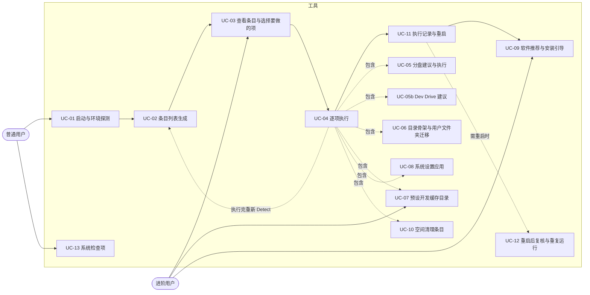
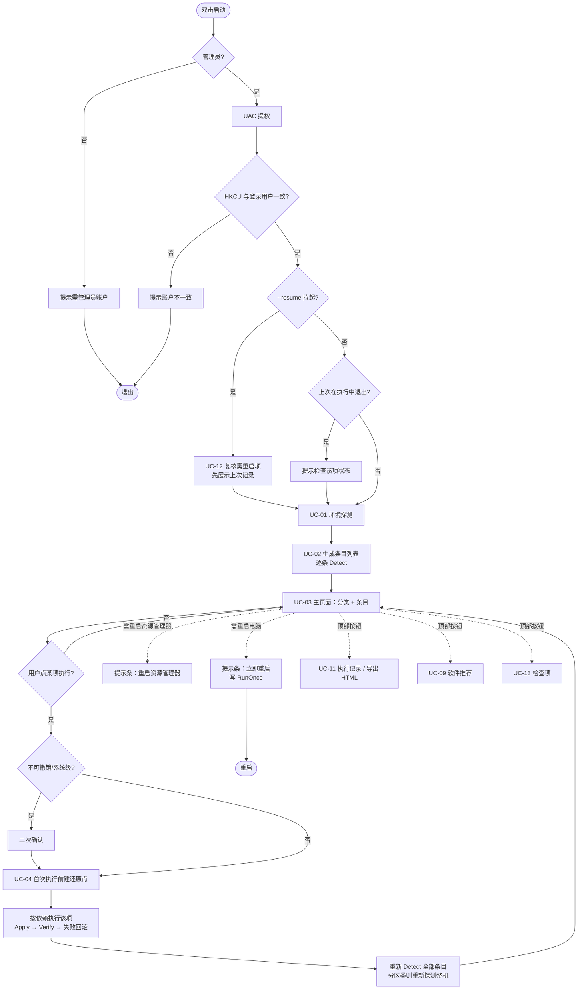
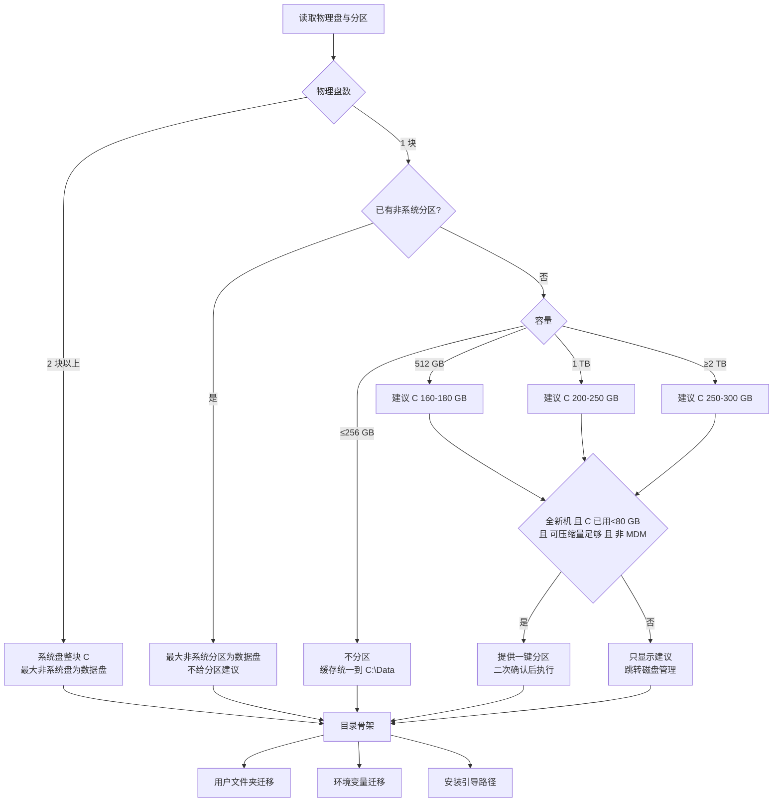
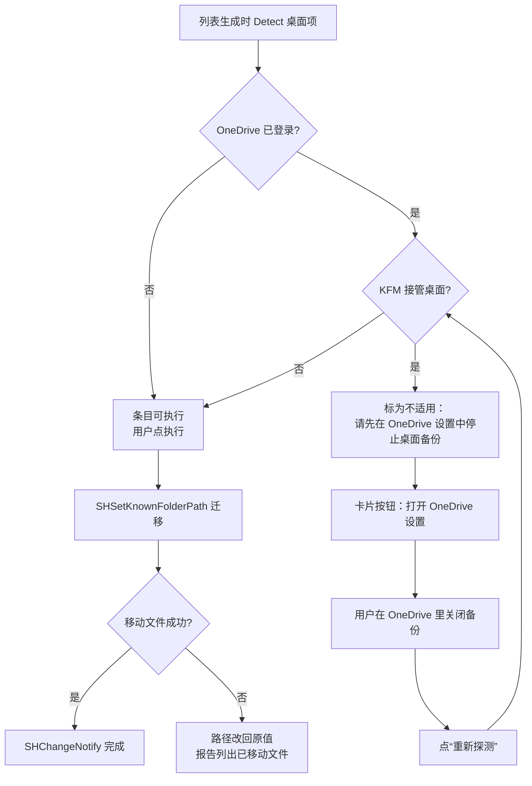
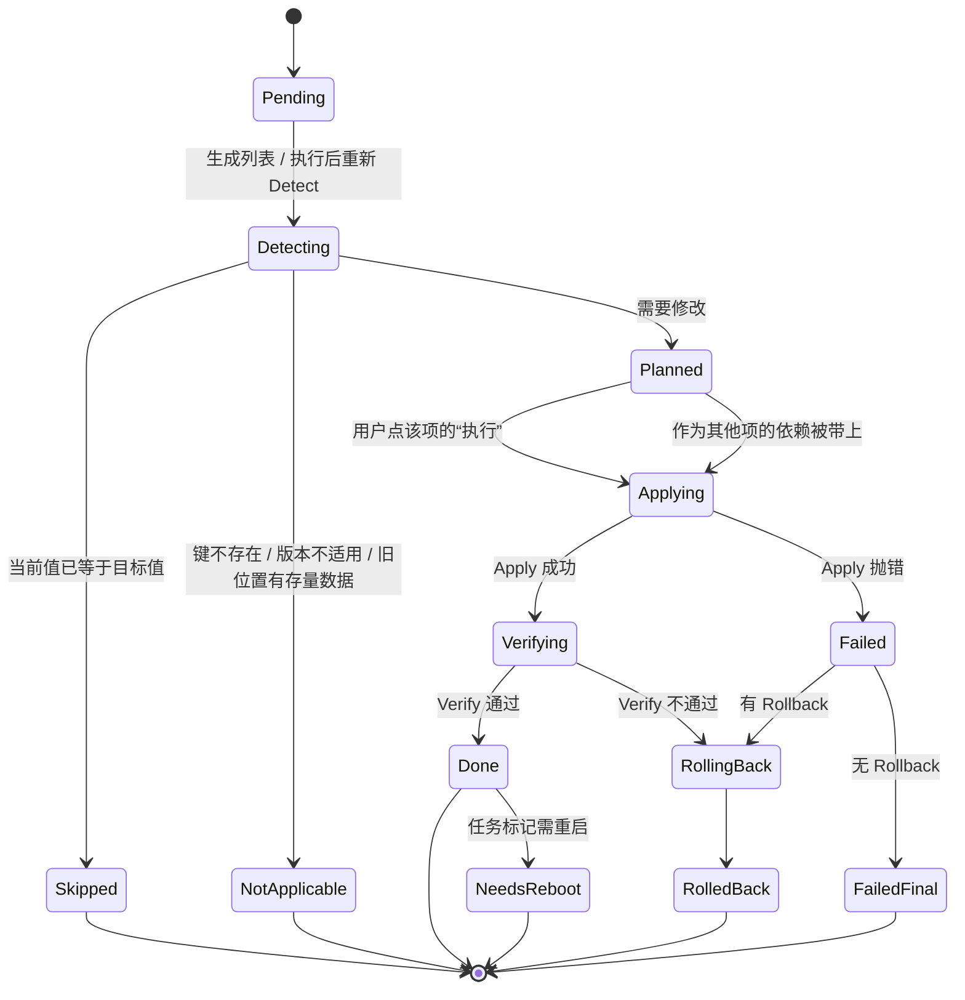
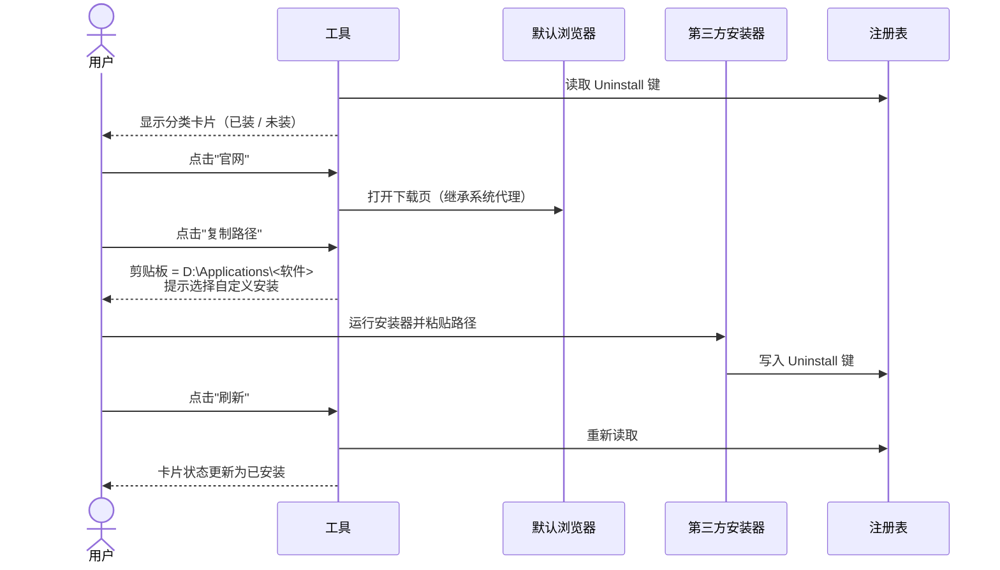
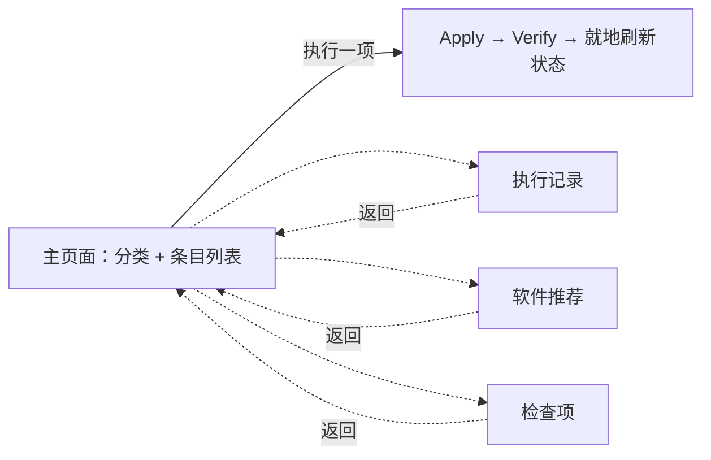

# 新机开荒工具：用例与用户流程 v2

日期：2026-09-03
范围基线：《开荒范围清单 v2》+ GPU 硬件加速调度（加回系统设置模块）。
v2 相对 v1：取消问卷向导，改为启动即探测、按分类列出全部条目、逐项执行（见 §5）。UC-02/03/04 与 §4.1、§4.3、§4.4、§4.6 已按此重写，UC-13 为新增的只读检查项。本文描述的都是已实现的行为。

---

## 1. 参与者

| 参与者 | 说明 |
|---|---|
| 普通用户 | 新机到手，照着“推荐”徽标逐项点执行，不想研究每一项背后的原理。没有“全部执行”，见 §5 |
| 进阶用户 | 开发者/游戏玩家，会逐条挑选要做的项，关注路径与缓存 |
| Windows | 注册表、Shell 已知文件夹 API、环境变量、分区服务、还原点 |
| OneDrive | 外部依赖，决定桌面能否迁移 |
| 默认浏览器 | 承接软件官网入口 |
| 第三方安装器 | 工具不控制，仅引导 |

---

## 2. 用例总览

二期用例（本版只留接口）：UC-14 撤销上次执行、UC-15 导出/导入方案。

---

## 3. 用例详述

格式：参与者 / 前置 / 触发 / 主流程 / 分支与异常 / 后置 / 权限。

### UC-01 启动与环境探测

- 参与者：用户、Windows
- 前置：Windows 11 22H2+，用户为管理员组成员
- 触发：双击 exe
- 主流程：
  1. 以管理员启动（manifest requireAdministrator），UAC 弹窗一次。
  2. 校验提权后的 HKCU 与桌面登录用户一致，不一致则提示并退出。
  3. 后台线程探测：硬件、磁盘与分区、OEM、MDM、代理、OneDrive 状态、已装开发工具、路径类环境变量、GPU 是否支持硬件加速调度。全是注册表与 WMI 读取，本机实测约 0.2 秒，不做任何目录体积扫描。
  4. 头部只留探测状态、条目汇总、数据盘下拉与"重新探测"；硬件与系统信息全部落在左栏第一项"这台电脑"里：系统与安装日期、机型、处理器、内存、每块物理盘、每个卷的总量/已用/剩余、管理与网络状态、OneDrive、识别到的开发工具、探测时间。容量一律按 GiB 保留两位并附字节原值，不做四舍五入。受管理、无数据盘、系统盘吃紧以黄色警告条呈现；OneDrive 接管桌面属于单个条目的情况，写在桌面条目的卡片上，不占头部。探测完成后头部显示“探测于 HH:mm:ss”，与旁边的“重新探测”对应。
- 分支与异常：
  - 非管理员：提示需要管理员账户，退出。
  - MDM/域管：标记"受管理"，后续所有 HKLM 类任务降级为提示。
  - Windows 10：提示不支持，退出。
  - 探测与列表生成都在后台线程上跑，窗口全程可操作；期间头部显示“正在探测这台电脑…”“正在检查各项当前状态…”，所有“执行”按钮禁用。
  - 黄色警告条只是提醒，用户可以逐条关掉；关闭状态按提示文本记在本次运行里，重新探测不会让它重新出现。
- 后置：生成 `EnvironmentSnapshot`，供方案生成器使用。
- 权限：管理员。

### UC-02 条目列表生成

- 参与者：工具
- 前置：UC-01 完成
- 触发：探测结束自动进行；换数据盘或执行完任意一项后重新进行
- 主流程：
  1. 数据盘取探测结果，用户可在头部下拉里改。
  2. `Planner` 按 Snapshot + `Answers`（只剩数据盘与是否分区）从任务库筛掉不适用的任务，逐任务运行 `Detect`。
  3. 结果按 `Module` 分组成分类：分区 / 磁盘与路径 / 开发缓存 / 界面与交互 / 中文输入法 / 去推送 / 显卡 / 空间清理。
  4. 每条按 `Detect` 结果落到三种状态：已满足（Skipped，无按钮）、可执行（Planned）、不适用（NotApplicable，原因单独一行显示）。可执行的按 `DefaultChecked` 显示"推荐"或"可选"徽标——徽标只影响措辞，不预先勾选任何东西。
  5. “当前 → 目标”给的是人话：注册表类条目在任务目录里为每个值标了含义（如任务栏搜索样式：搜索框+标签 → 仅图标），原始键值放进 `PlanItem.Detail`，界面只在悬停时显示。
- 分支与异常：
  - 未检测到数据盘：路径、缓存类任务的 `IsApplicable` 为假，整组不出现；头部给警告并引导去"分区"分类。
  - `Detect` 抛异常：该条标为不适用并把异常写进原因，不影响其他条目。
- 后置：`Plan` 写入 `%ProgramData%\WinHomestead\plan-<会话>.json`。
- 权限：普通。

### UC-03 查看条目与选择要做的项

- 参与者：用户（进阶用户为主）
- 前置：UC-02 完成
- 触发：主页面常驻
- 主流程：
  1. 左栏选分类（附"N 项可执行"），右栏是该分类的条目卡片：名称、状态徽标（推荐绿底、已满足带 ✓、不适用灰字）、说明、不适用原因、当前 → 目标（悬停看原始键值）、风险标签（只在可执行时显示：可撤销 / 重启资源管理器生效 / 注销后生效 / 需重启 / 系统级 / 只给步骤 / 不可撤销）、上次执行结果。探测完成后首次落在第一个有可执行项的分类，不停在只读的“这台电脑”。
  2. 头部汇总：共 N 项 · 可执行 M 项 · 已满足 K 项。
  3. 用户决定点哪一项的"执行"按钮，没有勾选框，也没有"全部执行"。
- 分支与异常：
  - 已满足与不适用的条目没有按钮。
  - 探测中或有任务正在执行时，全部按钮禁用。
- 后置：无系统改动。
- 权限：普通。

### UC-04 逐项执行

- 参与者：用户、Windows
- 前置：目标条目状态为"可执行"
- 触发：点击某条目的"执行"
- 主流程：
  1. 不可撤销或系统级的条目先弹二次确认。
  2. 本会话第一次执行前创建系统还原点（失败仅警告，不阻断）。
  3. `SessionRunner` 取该条目及其在列表中仍为"可执行"的祖先依赖，组成子方案交给 `TaskRunner`：Apply → Verify → 失败则回滚。
  4. 结果写进卡片下方，并累加到会话结果文件 `result-<会话>.json`。
  5. 执行完重新 `Detect` 全部条目并就地刷新；分区类条目执行后重新探测整机。
- 分支与异常：
  - 单项失败：记录错误，有 Rollback 则回滚该项，按钮变"重试"。
  - 需重启资源管理器 / 需重启电脑：只记标志，由提示条让用户自己决定何时重启，不在执行流程里强制。
  - 应用崩溃：journal 与 plan 在磁盘，下次启动进入 UC-12。
  - 停止：执行期间进度行旁出现"停止"按钮，点了在当前任务做完后停止，已完成的项保留。取消只在任务边界检查，不会打断正在写入的任务；单项执行常常只有一个任务，带依赖时才真正有得停。
- 后置：`ExecutionResult` 写入磁盘。
- 权限：管理员（还原点与系统级条目）。

### UC-05 分盘建议与执行

- 参与者：用户、Windows 分区服务
- 前置：探测到单物理盘且无数据分区，或用户主动进入
- 触发：点击"分区"分类中的"压缩 C 盘并新建数据分区"
- 主流程：
  1. 按容量规则算出建议 C 大小与 D 大小。
  2. `Detect` 调用 `Get-PartitionSupportedSize` 取 C 的最小可压缩尺寸；可释放空间 ≥ 建议 D 的 80% 时该条为可执行，否则标为不适用并说明差多少。
  3. 执行前二次确认弹窗，列出：将压缩 C 到 X GB，新建 D 卷 Y GB，不会删除任何数据。
  4. 依次 `Resize-Partition` → `New-Partition` → `Format-Volume`（NTFS，卷标 Data）→ 分配盘符 D。
  5. 刷新 Snapshot，数据盘设为 D。
- 分支与异常：
  - 前置条件不满足（非全新机 / 可压缩量不足 / MDM）：只显示建议数字与"打开磁盘管理"按钮。
  - 压缩失败（不可移动文件阻挡）：提示关闭休眠与页面文件后重试，或手动处理。
  - 盘符 D 被光驱/读卡器占用：自动选下一个可用盘符并告知。
- 后置：新数据卷可用，后续迁移任务目标更新。
- 权限：管理员。

### UC-05b Dev Drive 建议

- 参与者：用户
- 前置：有数据盘、内存 ≥ 8 GB、Build ≥ 22621（官方前置条件，不满足则条目不出现）
- 触发：点击"分区"分类中的"Dev Drive 建议（手动）"
- 主流程：
  1. `Detect` 读数据盘的文件系统。是 ReFS 就判为已满足（Windows 11 客户端上的 ReFS 卷只可能来自 Dev Drive）。
  2. 是 NTFS 时读所在磁盘的最大连续空闲空间：≥ 50 GB 建议用未分配空间新建，不足则建议新建 VHDX。
  3. 执行只写手动步骤：设置路径、这台机器该选哪种载体、已有数据的卷不能就地转换、开发工具本体仍装系统盘、`fsutil devdrv query` 自查信任状态、TEMP 指过去要先放行 `WinSetupMon`。
- 分支与异常：
  - MDM 管控：列出但标不适用，原因是企业环境要管理员在组策略里放开。
  - 读不到数据盘文件系统：标不适用。
- 后置：不改动任何卷。工具全程不调用格式化。
- 权限：普通（只读探测 + 写手动项）。

### UC-06 目录骨架与用户文件夹迁移

- 参与者：用户、Windows Shell、OneDrive
- 前置：数据盘已确定
- 触发：点击本组中某个条目的"执行"
- 主流程：
  1. 在数据盘创建 `Applications / DevCache / Data / Temp / Models / VMs / Games`，已存在则复用。
  2. 将 `Applications` 固定到资源管理器快速访问。
  3. 对 Documents / Downloads / Pictures / Videos / Music：`SHSetKnownFolderPath` 到 `Data\<名>`，移动原目录内容，`SHChangeNotify`。
  4. 用户 TEMP/TMP 指向 `Temp`，清理旧 Temp 中 7 天前文件。
- 分支与异常：
  - 桌面：单列一条，不标"推荐"。被 OneDrive KFM 接管时 `Detect` 直接返回"不适用：桌面由 OneDrive 备份接管，请先在 OneDrive 设置中停止桌面备份"，卡片没有执行按钮，改为一个"打开 OneDrive 设置"按钮，走 `odopen://launch/settings`（协议不可用时退回 `OneDrive.exe /settings`，再不行给文字步骤）。用户关掉备份后点"重新探测"，该条会变成可执行。工具全程不改 OneDrive 的任何设置。
  - 目标已存在同名文件：跳过该文件并记录，不覆盖。
  - 移动中途失败：把已知文件夹路径改回原值，已移动文件留在目标并在报告中列出。
  - 探测到已迁移（路径已在非 C 盘）：任务状态"跳过"。
- 后置：已知文件夹指向数据盘。
- 权限：普通（HKCU + 用户文件）。

### UC-07 预设开发缓存目录

- 参与者：进阶用户
- 前置：数据盘已确定
- 触发：点击“开发缓存”分类里的“预设开发缓存目录（装工具之前做）”
- 主流程：
  1. 这一条把 pip、uv、npm（含全局包目录）、pnpm、Yarn、Gradle、NuGet、Cargo、Go、Flutter、Conda、Hugging Face、Ollama 的缓存目录一次性用用户环境变量指到数据盘 DevCache/Models 下。
  2. 跳过两类：变量已经设过的（不覆盖用户自己的选择）、对应工具已经装在本机的（改在用工具的缓存位置要连存量一起搬，不在本工具范围内）。
  3. 写 `npm_config_prefix` 时同时把该目录追加进用户 PATH，否则 `npm -g` 装出来的命令敲不出来。
- 分支与异常：
  - 涉及的工具全都已安装：整条标为不适用，原因里列出是哪些工具。
  - 没有数据盘：整条不出现。
  - Android SDK、Docker、JetBrains 这类只能改应用内设置或要搬大体积数据的，不做成条目；检测到时在执行记录页给一句手动步骤。Maven 原先也在这一档，实际上可以通过 `MAVEN_OPTS` 传 `-Dmaven.repo.local`，已改为正式条目。
- 定位：这是“装之前先铺路”，不是“事后搬家”。开荒工具只管新机上还没装的东西。
- 后置：以后装上的工具缓存直接落在数据盘。
- 权限：普通（HKCU 环境变量），注销后对新进程生效。

### UC-08 系统设置应用

- 参与者：用户、Windows
- 前置：该条目状态为"可执行"
- 触发：点击本组中某个条目的"执行"
- 主流程：
  1. 按条目写 HKCU：扩展名、隐藏文件、打开到此电脑、桌面此电脑、鼠标加速、粘滞键、结束任务、搜索框图标、Alt+Shift 热键、任务栏对齐、任务视图/小组件、经典右键、深色模式、开始菜单布局、微软拼音三项、去推送组。
  2. GPU 硬件加速调度：探测 GPU 支持（设置页有开关即支持）后写 HKLM `GraphicsDrivers\HwSchMode=2`，标记需重启。
  3. 执行完不自动重启 Explorer；带"重启资源管理器生效"标签的项做过之后，头部出现提示条，由用户点按钮重启一次。
- 分支与异常：
  - 注册表键不存在（版本差异）：`Detect` 标为不适用并给出原因。
  - MDM 受管：GPU 调度整条不列出（`IsApplicable` 为假），不是降级为提示。
  - 微软拼音未安装（用户已换第三方输入法）：拼音三项跳过。
- 后置：设置生效，GPU 调度待重启。
- 权限：HKCU 普通；GPU 调度需管理员。

### UC-09 软件推荐与安装引导

- 参与者：用户、默认浏览器、第三方安装器
- 前置：数据盘与 `Applications` 目录已就绪
- 触发：顶部"软件推荐"按钮
- 主流程：
  1. 页面顶部先规划安装目录：可编辑的根目录（默认 `<数据盘>\Applications`）+ "恢复默认"，下面按固定分类顺序（基础工具 → 浏览器 → 通讯 → 办公 → 媒体 → 开发 → 游戏 → 运行库）展示卡片，每个分类带一句话说明它值不值得装。
  2. 每项显示官网链接、可编辑的建议路径（`<根目录>\<分类子目录>\<软件目录>`）、是否支持自定义路径、是否已安装；改过路径的标"自定义路径"。
  3. 点击"官网"：在默认浏览器打开下载页（继承系统代理）。
  4. 点击"复制路径"：`D:\Applications\Tools\7-Zip` 这样的完整路径进剪贴板，安装时选"自定义安装"粘贴即可。
  5. 用户自行下载安装。
  6. 回到工具，点击"刷新已安装状态"重新检测。勾上底部的"隐藏已安装的"，装过的项连同全部已装的分类一起收起，只在本次会话内生效。
  7. 底部"商店应用保存位置"按钮跳到 `ms-settings:savelocations`，用户自己把商店新应用的安装盘改到数据盘（无公开接口，工具不代改）。
- 分支与异常：
  - 安装器不支持自定义路径：不显示路径框，只给说明（如 Electron 默认装到 LocalAppData）。
  - 官网无法访问：显示"复制链接"备用。
  - 根目录或某项路径被改：存进 `software-paths.json`，下次进页面沿用；把某项改回默认值即自动取消该项记忆，"恢复默认"清空全部。
- 定位：这是推荐不是待办清单，页面明说"按需要挑，不用照单全装"；工具不下载、不代装、不改默认程序。
- 后置：无系统改动。
- 权限：普通。

### UC-10 空间清理条目

- 参与者：用户
- 前置：UC-02 完成
- 触发：点击主列表"空间清理"分类里的条目：清理旧临时目录 / 关闭休眠（台式机）/ 开启存储感知
- 主流程：
  1. 清理旧临时目录：`Detect` 在 0.8 秒预算内数用户 Temp 里 7 天前的文件并估算体积，执行时逐个删除，被占用的跳过并写进手动项。
  2. 关闭休眠：只在台式机且非 MDM 时列出，不标推荐；执行 `powercfg /hibernate off`。
  3. 开启存储感知：HKCU StoragePolicy，频率"磁盘空间不足时"。
- 分支与异常：
  - 笔记本：关闭休眠整条不出现。
  - 临时目录文件太多：本次只清一部分，手动项提示再执行一次。
- 定位：没有 C 盘大文件扫描子页。全新机器上没有存量垃圾可清，递归 AppData 十几秒的扫描属于旧机清理工具，不在开荒范围内。
- 后置：无。
- 权限：休眠关闭需管理员，其余普通。

### UC-11 执行记录与重启

- 参与者：用户
- 前置：本会话执行过至少一项（没执行过时页面显示"还没有执行过任何项"）
- 触发：顶部"执行记录"按钮（有手动项时按钮文字带数量，如"执行记录（3 项手动）"，没进过这一页的用户也知道有东西要看）；重启后由 RunOnce 拉起时自动进入
- 主流程：
  1. 汇总本会话逐项结果：成功 / 失败 各多少，每项一行带结果说明。
  2. "手动项"清单：任务执行中产生的（如同名文件未移动）、OneDrive 桌面备份、Docker 镜像位置，以及 Conda / Android 等在判定为不适用时给出的具体原因，还有 Dev Drive 条目执行后写下的创建步骤。（BitLocker 密钥备份、多余杀软、OEM 软件、默认应用不在这里，它们是只读检查项，见 UC-13。）
  3. 有需重启的项时主页面出现提示条，点"立即重启"写 RunOnce 并 15 秒后重启，重启后自动打开并复核。
  4. 报告导出为 HTML 到数据盘 `Data\开荒报告-<日期>.html`；没有数据盘时落在 `%ProgramData%\WinHomestead`。
- 后置：用户可关闭工具，也可返回列表继续做别的项。
- 权限：普通。

### UC-12 重启后复核与重复运行

- 参与者：用户
- 前置：上次执行写过 RunOnce，或上次进程在执行某项时退出
- 触发：开机自动拉起（`--resume`），或用户再次运行
- 主流程：
  1. 启动时读取上次会话的 `state.json` 与 `plan` / `result`。
  2. `--resume` 拉起：对上次标"需重启"的项重新 `Verify`，通过的改为完成，先展示复核后的记录，用户返回列表继续。
  3. 上次进程在执行中退出（`pendingResume=true`）：弹一次提示，请用户在列表中查看该项的当前状态后自行决定是否重新执行。逐项执行没有"剩余项"的概念，不自动续跑。
  4. 正常再次运行：重新探测，做过的项 `Detect` 都为已满足，分类副标题显示"全部已满足"。
- 后置：幂等，重复运行无副作用。
- 权限：管理员。

### UC-13 系统检查项

- 参与者：用户
- 前置：无（不依赖数据盘，也不依赖启动探测）
- 触发：顶部"检查项"按钮
- 主流程：
  1. 进页面时按需采集十项：BitLocker 加密状态、安全中心注册的杀软、最近安装的补丁时间、还原点占用（Point-in-time restore）、OEM 预装软件、开机启动项、屏幕刷新率、电池健康、默认浏览器关联、区域与时区。采集在后台线程进行，页面显示"正在检查…"。
  2. 每项一张卡片：标题、状态徽标（有风险的标黄）、检测到的事实、建议、以及一个跳转到对应设置页的按钮。
  3. 用户自己去设置里处理，回来可点"重新检查"；状态行显示"检查于 HH:mm:ss"。
- 分支与异常：
  - 单项采集失败（无权限、WMI 类不存在）：该项状态为"未知"并把原因写进详情，不影响其他项。
  - 电池健康是唯一会起外部进程的一项：部分机型的固件不响应 `BatteryStaticData`，这时回退到 `powercfg /batteryreport /xml`，写一个临时文件读完即删。
  - 全程只读：不写注册表、不卸载、不联网，因此没有 journal 与回滚。
- 后置：无系统改动。
- 权限：BitLocker 状态需管理员（程序本身即以管理员运行）。

---

## 4. 用户流程图

### 4.1 主流程

### 4.2 磁盘与路径决策

### 4.3 桌面迁移与 OneDrive

### 4.4 单任务状态机（执行引擎）

### 4.5 软件推荐页交互

### 4.6 重启后复核

逐项执行没有"剩余任务"的概念，因此不存在自动续跑：上次进程若在执行某项时退出，启动时只弹提示请用户查看该项状态，由用户决定是否重新点执行。

---

## 5. 界面导航（v2：分类列表，逐项执行）

不再是问卷向导。启动即探测，主页面按分类列出全部条目，每条显示“当前 → 目标”、状态与风险标签，右侧“执行”按钮点了立刻执行该项。执行记录、软件推荐、检查项 为可返回的子页，返回入口只有顶部一个“← 返回列表”，子页底部只放本页自己的动作。没有勾选框和“全部执行”：每一项在列表里都可见、可单独执行，多一层批量只是多一次确认。

| 区域 | 核心元素 | 交互约束 |
|---|---|---|
| 头部 | 条目汇总、探测状态（完成后为“探测于 HH:mm:ss”）、数据盘下拉、“重新探测” | 探测中所有“执行”禁用；换数据盘后全部条目重新 Detect；机器信息不堆在这里，见左栏“这台电脑”；容量一律两位小数 |
| 提示条 | 只放全局情况：MDM/无数据盘/系统盘吃紧的黄色警告；“重启资源管理器”“立即重启”蓝色操作条 | 只在有相应情况时出现。黄色警告右上角可关闭，关掉的这次运行里不再出现，重新探测也不会重新冒出来；蓝色操作条不提供关闭，做完对应操作会自己消失。单个条目的情况（如 OneDrive 接管桌面）写在条目卡片上，不进提示条 |
| 左栏 | 第一项固定是“这台电脑”（硬件与系统信息），其后是分区 / 磁盘与路径 / 开发缓存 / 界面与交互 / 中文输入法 / 去推送 / 显卡 / 空间清理，附“N 项可执行” | 任务分类由 Module 决定；选中“这台电脑”时右栏换成只读信息列表 |
| 右栏 | 条目卡片：名称、状态徽标（推荐 / 可选 / ✓ 已满足 / 不适用）、说明、不适用原因（单独一行）、当前/目标（人话，悬停看原始键值）、风险标签（仅可执行项）、执行结果 | 已满足与不适用的没有执行按钮；不适用项可以有一个辅助按钮（桌面被接管时的“打开 OneDrive 设置”）；不可撤销或系统级的执行前二次确认，确认框里写的是人话的目标值 |
| 执行 | 单项执行；该项未满足的依赖父项自动先执行；执行期间进度行旁有“停止”按钮 | 同一时间只执行一项；停止在任务边界生效；执行完重新 Detect 全部条目 |
| 执行记录 | 本次会话逐项结果、手动项、导出 HTML、立即重启 | 重启后由 RunOnce 拉起时先显示复核后的上次记录；顶部按钮上带手动项数量 |
| 检查项 | BitLocker / 杀软 / 补丁时间 / 还原点占用 / OEM 预装 / 启动项 / 刷新率 / 电池健康 / 默认应用 / 区域时区，各带一个跳转设置的按钮（电池一项没有可跳转的设置页） | 全部只读，工具不代改；进页面时才采集（见 UC-13） |

问卷里原来的选项（界面风格、输入法、去推送）都变成了列表中的“可选”条目，不再事先询问。

---

## 6. 任务库索引（供后续实现对照）

| 任务 ID | 模块 | 需管理员 | 需重启 | 可回滚 |
|---|---|---|---|---|
| disk.suggest | 磁盘 | 否 | 否 | — |
| disk.shrink_and_create | 磁盘 | 是 | 否 | 否（只做不撤） |
| disk.devdrive（只给建议与步骤，不格式化） | 磁盘 | 否 | 否 | — |
| path.skeleton | 路径 | 否 | 否 | 是（仅删空目录） |
| path.quick_access | 路径 | 否 | 否 | 是 |
| path.known_folder.{documents,downloads,pictures,videos,music,desktop} | 路径 | 否 | 否 | 是 |
| path.temp.user | 路径 | 否 | 否 | 是 |
| path.temp.machine | 路径 | 是 | 否 | 是 |
| env.preset（一条，预设 19 个缓存类变量 + npm 全局包目录进 PATH） | 缓存 | 否 | 注销 | 是 |
| ui.{file_ext,hidden_files,launch_to_pc,desktop_this_pc,end_task,search_icon} | 设置 | 否 | Explorer | 是 |
| ui.{lang_hotkey,mouse_accel,sticky_keys} | 设置 | 否 | 注销 | 是 |
| ui.{taskbar_left,taskview_widgets,classic_menu,start_layout} | 设置 | 否 | Explorer | 是 |
| ui.dark_mode | 设置 | 否 | 否 | 是 |
| ime.{default_english,punct_hotkey,shift_switch} | 设置 | 否 | 注销 | 是 |
| promo.{suggestions,start_recommend,bing_search} | 设置 | 否 | Explorer | 是 |
| promo.{lockscreen,ad_id} | 设置 | 否 | 否 | 是 |
| gpu.hags | 设置 | 是 | 系统 | 是 |
| storage.temp_cleanup | 治理 | 否 | 否 | 否 |
| storage.hibernate_off | 治理 | 是 | 否 | 是 |
| storage.sense | 治理 | 否 | 否 | 是 |
| system.restore_point | 收尾 | 是 | 否 | — |
| system.report | 收尾 | 否 | 否 | — |

最后两行不是任务库里的 `ITask`：还原点由 `SessionRunner` 在会话首次执行前创建一次，报告由执行记录页的 `ReportHtml` 生成。
